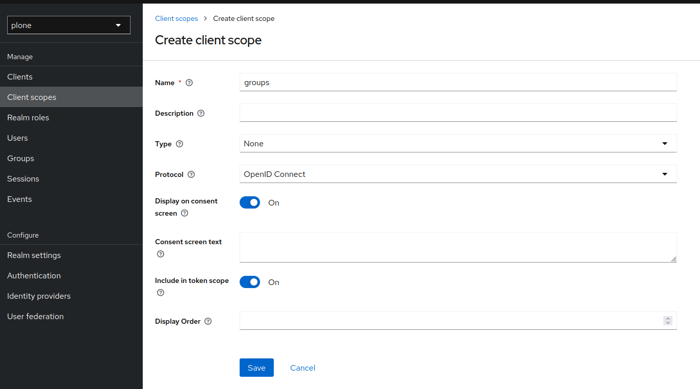
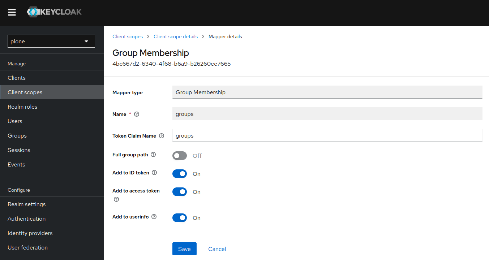
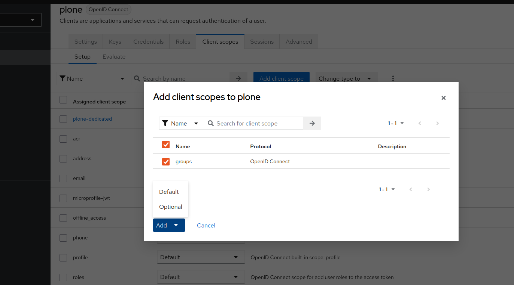

<div align="center"></div>

<h1 align="center">pas.plugins.oidc</h1>

<div align="center">

[](https://pypi.org/project/pas.plugins.oidc/)
[](https://pypi.org/project/pas.plugins.oidc/)
[](https://pypi.org/project/pas.plugins.oidc/)
[](https://pypi.org/project/pas.plugins.oidc/)
[](https://pypi.org/project/pas.plugins.oidc/)


[](https://pypi.org/project/pas.plugins.oidc/)

[](https://github.com/collective/pas.plugins.oidc/actions/workflows/ci.yml)


[](https://github.com/collective/pas.plugins.oidc)
[](https://github.com/collective/pas.plugins.oidc)

</div>

## Intro
This is a Plone authentication plugin for OpenID Connect.
OAuth 2.0 should work as well because OpenID Connect is built on top of this protocol.

## Features

- PAS plugin, although currently no interfaces are activated.
- Three browser views for this PAS plugin, which are the main interaction with the outside world.

### Group Enumeration

If you need to support group enumeration from a Keycloak server, we recommend installing the package [pas.plugins.keycloakgroups](https://pypi.org/project/pas.plugins.keycloakgroups/).

## Installation

This package supports Plone sites using Volto and Classic UI.

For proper Volto support, the requirements are:

* plone.restapi >= 8.34.0
* Volto >= 16.10.0

Add **pas.plugins.oidc** to the Plone installation using `pip`:

``bash
pip install pas.plugins.oidc
``

### Requirements

As of version 2.* of this package the minimum requirements are Plone 6.0 and python 3.8.

### Warning

Pay attention to the customization of `User info property used as userid` field, with the wrong configuration it's easy to impersonate another user.


## Configure the plugin

* Go to the Add-ons control panel and install `pas.plugins.oidc`.
* In the ZMI go to the plugin properties at `http://localhost:8080/Plone/acl_users/oidc/manage_propertiesForm`
* Configure the properties with the data obtained from your provider:
  * `OIDC/Oauth2 Issuer`
  * `Client ID`
  * `Client secret`
  * `redirect_uris`: this needs to match the **public URL** where the user will be redirected after the login flow is completed. It needs to include
    the `/Plone/acl_users/oidc/callback` part. When using Volto you need to expose Plone somehow to have the login process finish correctly.
  * `Use Zope session data manager`: see the section below about the usage of session.
  * `Create user / update user properties`: when selected the user data in Plone will be updated with the data coming from the OIDC provider.
  * `Create authentication __ac ticket`: when selected the user will be allowed to act as a logged-in user in Plone.
  * `Create authentication auth_token (Volto/REST API) ticket`: when selected the user will be allowed to act as a logged-in user in the Volto frontend.
  * `Open ID scopes to request to the server`: information requested to the OIDC provider. Leave it as it is or modify it according to your provider's information.
  * `Use PKCE`: when enabled uses [PKCE](https://datatracker.ietf.org/doc/html/rfc7636) when requesting authentication from the provider.

### Login and Logout URLs

#### Default UI (Volto)

When using this plugin with a [Volto frontend](https://6.docs.plone.org/volto/index.html), please install [@plone-collective/volto-authomatic](https://github.com/collective/volto-authomatic) add-on on your frontend project.

* **Login URL**: `<Path to your Plone site>`/login
* **Logout URL**: `<Path to your Plone site>`/logout

Also, on the OpenID provider, configure the Redirect URL as **`<Path to your Plone site>`/login-oidc/oidc**.

#### Classic UI

When using this plugin with *Plone 6 Classic UI* the standard URLs used for login (`http://localhost:8080/Plone/login`) and logout (`http://localhost:8080/Plone/logout`)
will not trigger the usage of the plugin.

To login into a site using the OIDC provider, you will need to change those login URLs to the following:

* **Login URL**: /`<Plone Site Id>`/acl_users/`<oidc pas plugin id>`/login
* **Logout URL**: /`<Plone Site Id>`/acl_users/`<oidc pas plugin id>`/logout

*Where:*

  * `Plone Site Id`: is the id you gave to the Plone site when you created it. It is usually `Plone` but may vary. It is the last part of the URL when you browse Plone directly without using any proxy server, ex. `http://localhost:8080/Plone+` -> `Plone`.

  * `oidc pas plugin id`: is the id you gave to the OIDC plugin when you created it inside the Plone PAS administration panel. If you just used the default configuration and installed this plugin using Plone's Add-on Control Panel, this id will be `oidc`.

### Example setup with Keycloak

The `pas.plugins.oidc` repository has a working setup for a `Keycloak` development server using `Docker` and `Docker Compose`. To use it, in a terminal, run the command:

#### Start-up

```bash
make keycloak-start
```

This does **not** give you a production setup, but it is fine for local development.

This command will use the [`docker-compose.yml`](./tests/docker-compose.yml) file available in the `tests` directory.

#### Manage Keycloak

After start up, Keycloak will be accessible on [http://127.0.0.1:8180](http://127.0.0.1:8180), and you can manage it with the following credentials:

* **username**: admin
* **password**: admin

#### Realms

There are two realms configured `plone` and `plone-test`. The later is used in automated tests, while the former should be used for your development environment.

The `plone` realm ships with an user that has the following credentials:

* username: **user**
* password: **12345678**

And, to configure the oidc plugins, please use:

* client id: **plone**
* client secret: **12345678**

#### Stop Keycloak

To stop a running `Keycloak` (needed when running tests), use:

```bash
make keycloak-stop
```

#### Warning

Attention, before Keycloak 18, the parameter for logout was `redirect_uri` and it has been deprecated since version 18. But the
Keycloak server can run with the `redirect_uri` if needed, it is possible to use the plugin with the legacy `redirect_uri`
parameter enabled also. The problem is that if the deprecated parameter is enabled in the plugin but not in the server, the plugin
will not work.

So, this is the way it works:
* With legacy `redirect_uri` parameter enabled in Keycloak, the plugin works in default mode.
* With legacy `redirect_uri` parameter enabled in Keycloak, the plugin also works with legacy mode.
* With legacy `redirect_uri` parameter disabled in Keycloak (default after version 18), the plugin works in default mode.
* With legacy `redirect_uri` parameter disabled in Keycloak (default after version 18), the plugin does NOT work with legacy mode.

So, for Keycloak, it does not matter if we use the default or legacy mode if the Keycloak runs in legacy mode.

*Notes:*

* If legacy `redirect_uri` parameter is disabled in Keycloak, this is the default since version 18 of Keycloak according
  to this comment in *Stack Overflow*: https://stackoverflow.com/a/72142887.
* The plugin will work only if the `Use deprecated redirect_uri for logout url(/Plone/acl_users/oidc/logout)`
  option is un-checked at the plugin properties at http://localhost:8080/Plone/acl_users/oidc/manage_propertiesForm.

#### Additional Documentation

Please refer to the [Keycloak documentation](https://www.keycloak.org/documentation>) for up to date instructions.
Specifically, here we will use a Docker image, so follow the instructions on how to [get started with Keycloak on Docker](https://www.keycloak.org/getting-started/getting-started-docker).

#### Setup Plone as a client

* Make sure **pas.plugins.oidc** is installed.
* Start Plone and create a Plone site with id Plone.
* In the Add-ons control panel, install `pas.plugins.oidc`.
* In the ZMI go to the plugin properties at http://localhost:8080/Plone/acl_users/oidc/manage_propertiesForm
* Set these properties:
  * `OIDC/Oauth2 Issuer`: http://127.0.0.1:8180/realms/plone/
  * `Client ID`: *plone* (**Warning:** This property must match the `Client ID` you have set in Keycloak.)
  * `Client secret`: *12345678* (**Warning:** This property must match the `Client secret` you have get in Keycloak.)
  * `Use deprecated redirect_uri for logout url` checked. Use this if you need to run old versions of Keycloak.
  * `Open ID scopes to request to the server`: this depends on which version of Keycloak you are using, and which scopes are available there.
    In recent Keycloak versions, you *must* include `openid` as scope.
    Suggestion is to use `openid` and `profile`.
  *  **Tip:** Leave the rest at the defaults, unless you know what you are doing.
  * Click `Save`.

**Plone is ready done configured!**

See this screenshot:


#### Login

Go to the other browser, or logout as admin from [Keycloak Admin Console](http://127.0.0.1:8180/admin).
Currently, the Plone login form is unchanged.

Instead, for testing go to the login page of the plugin: http://localhost:8080/Plone/acl_users/oidc/login,
this will take you to Keycloak to login, and then return. You should now be logged in to Plone, and see the
*full name* and *email*, if you have set this in Keycloak.

#### Logout

If the login did work as expected you can try to Plone logout.
Currently, the Plone logout form is unchanged.

Instead, for testing go to the logout page of the plugin: http://localhost:8080/Plone/acl_users/oidc/logout,
this will take you to Keycloak to logout, and then return to the post-logout redirect URL.

#### Backchannel SLO (experimental)

OIDC Backchannel Logout is a server-to-server mechanism where the IdP notifies RPs via an HTTP POST request to terminate user sessions upon logout, ensuring secure and seamless Single Logout (SLO) without relying on the user's browser.
See the specification [OpenID Connect Back-Channel Logout 1.0](https://openid.net/specs/openid-connect-backchannel-1_0.html).

Current backchannel logout implementation, in this product, utilizes functionality introduced in plone.session >= 4.0.0 (Plone 6 and later) for server-side session invalidation (see plone.session PR [plone.session#26](https://github.com/plone/plone.session/pull/26)), and, at the moment, applies only to Plone Classic UI.

To enable this functionality:

1. Navigate to `.../acl_users/session/manage_secret` and enable the `Enable per-user keyring` option.

2. Configure the OpenID Provider (e.g., Keycloak) to use the backchannel logout endpoint with the url: `.../acl_users/oidc/backchannel-logout`

#### Allowed groups

If you need to restrict access to a specific group, you can use the `Allowed groups` field in the plugin configuration. If the user is not in any of the groups listed, the login will be denied.

To use this feature, you need to create a new scope in the OIDC Provider (e.g., Keycloak) and add the groups to the user's token.

In Keycloak, go to the `Client Scopes` section and create a new scope named `groups`. Then, go to the `Mappers` tab and create a new mapper with the name `groups` and type `Group Membership` (Uncheck the `Full groups path` option).
You can find this configuration in the `plone` realm in the `tests` directory. The `plone` client is also configured to use the `groups` scope.





After that, go to the `Client Scopes` section and add the new scope to the client you are using with the plugin (for instance, `plone`).



Finally, in the plugin configuration, add `groups` to the scopes field.

In the `Allowed groups` field, you can add the groups that are allowed to log in. For example, in this repository, you could set `Foundation Members`. Users who are not in this group will not be able to log in.

## Technical Decisions

### Usage of sessions in the login process

This plugin uses sessions during the login process to identify the user while he goes to the OIDC provider
and comes back from there.

The plugin has 2 ways of working with sessions:

- Use the Zope Session Management: if the `Use Zope session data manager` option in the plugin configuration is enabled,
  the plugin will use the session configuration configured in Zope. To do so we advise using [Products.mcdutils](https://pypi.org/project/Products.mcdutils/)
  to save the session data in a memcached based storage. Otherwise, Zope will try to use a ZODB-based session
  which has shown several problems in the past.

- Use the cookie-based session management: if the `Use Zope session data manager` option in the plugin
  configuration is disabled, the plugin will use a Cookie to save that information in the client's browser.

### Settings in environment variables

Optionally, instead of editing your OIDC provider settings through the ZMI, you can use [collective.regenv](https://pypi.org/project/collective.regenv/) and provide
a `YAML` file with your settings. This is very useful if you have different settings in different environments
and you do not want to edit the settings each time you move the contents.

### Varnish

Optionally, if you are using the [Varnish caching server](https://6.docs.plone.org/glossary.html#term-Varnish) in front
of Plone, you may see this plugin only partially working. Especially the `came_from` parameter may be ignored.
This is because the buildout standard configuration from [plone.recipe.varnish](https://pypi.org/project/plone.recipe.varnish/)
removes most cookies to improve anonymous caching.

The solution is to make sure the `__ac_session` cookie is added to the `cookie-pass` option.
Check what the current default is in the buildout recipe, and update it:


## Contribute

- Issue Tracker: https://github.com/collective/pas.plugins.oidc/issues
- Source Code: https://github.com/collective/pas.plugins.oidc

### Local Development Setup

You need a working `python` environment (system, `virtualenv`, `pyenv`, etc) version 3.8 or superior.

Then install the dependencies and a development instance using:

```bash
make install
```

### Start Local Server

Start Plone, on port 8080, with the command:

```bash
make start
```

#### Keycloak

The `pas.plugins.oidc` repository has a working setup for a `Keycloak` development server using `Docker` and `Docker Compose`. To use it, in a terminal, run the command:

```bash
make keycloak-start
```

There are two realms configured `plone` and `plone-test`. The later is used in automated tests, while the former should be used for your development environment.

The `plone` realm ships with an user that has the following credentials:

* username: **user**
* password: **12345678**

To stop a running `Keycloak` (needed when running tests), use:

```bash
make keycloak-stop
```

### Update translations

```bash
make i18n
```

### Format codebase

```bash
make format
```

### Run tests

Testing of this package is done with [`pytest`](https://docs.pytest.org/).

Run all tests with:

```bash
make test
```

Run all tests but stop on the first error and open a `pdb` session:

```bash
uv run pytest -x --pdb
```

Run tests named `TestServiceOIDCPost`:

```bash
uv run pytest -k TestServiceOIDCPost
```

## References

* Blog post: https://www.codesyntax.com/en/blog/log-in-in-plone-using-your-google-workspace-account

## License

The project is licensed under the GPLv2.
